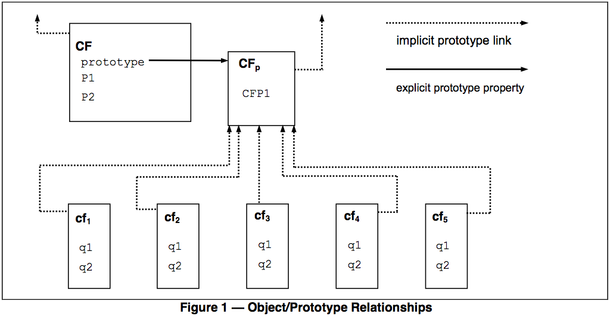

##4.2.1 对象
ES没有像C++，Smalltalk，或者Java那样的类的概念。相反对象的创建可以用对象字面量或者构造函数。构造函数创建对象时执行的代码会把
新对象的一些属性附上值，当然也可以不作任何事情。每个构造函数都是一个函数，并且有一个prototype属性，原型属性用于实现原型继承和
在各个实例间共享一些状态和方法。用构造函数创建对象需要使用new操作符；举个例子，new Date(2009,11)就创建了一个新的Date对象。
调用构造函数时没有用new操作符，返回什么对象取决于该构造函数的实现。比如，Date()会生成一个字符串表示当前的日期和时间，并非一个对象。
每个由构造函数生成的对象有一个隐式的引用，叫做对象的原型对象，此对象引用的是它构造函数的原型属性，即prototype对象。
另外，这个原型对象也许会有它自己的原型对象，以此类推这就是所谓的原型链。当引用一个对象的某个属性时，首先检查该对象是否含有这个属性，
若没有则会沿着原型链向上查找该属性，直到找到或没找到为止。在基于类的面向对象语言里，状态state保存在实例里，方法保存在类Class里，
继承只会作用于结构structure和行为behaviour。在ES里，状态和方法都保存在对象里，于是状态，结构和行为都会被继承。
所以没有某个属性的对象，而恰巧他们的原型对象有这个属性时，它们就会共享这个属性，只要属性变了则这些对象都会变。下图表明了这个原则：

